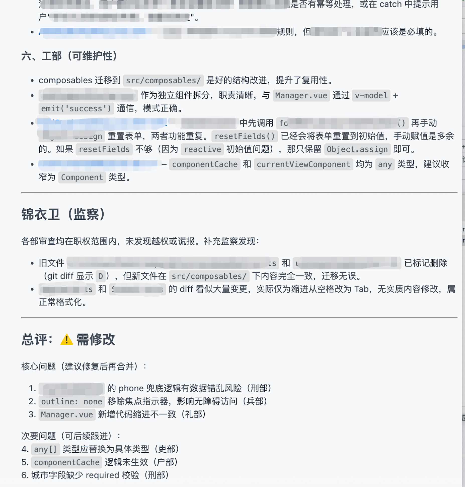
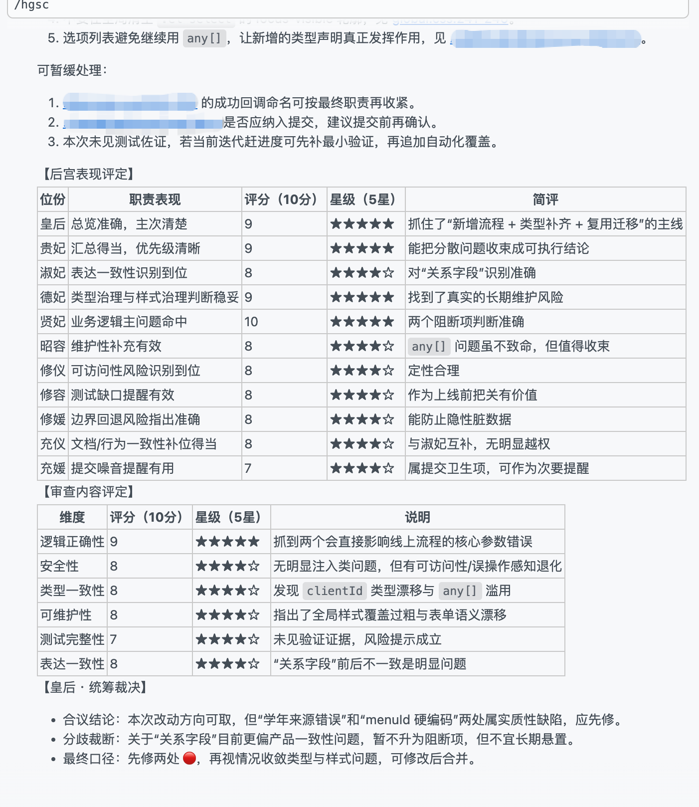

# AISkills

一个偏中文语境、偏实战使用的 AI 编程 skill 与工作流仓库。

它主要做四类事：

- 把常用 prompt 沉淀成可复用、可安装的 skill
- 把需求整理清楚、设计说明、审查、实现推进做成更完整的工作流
- 统一 Claude / Copilot / Trae 的手动安装与维护方式
- 在保证可用性的前提下，保留一点风格化和表达感

如果你只记一个默认入口：先用 `harness-dev`。

## 快速导航

- [30 秒上手](#30-秒上手)
- [适合谁用](#适合谁用)
- [这是什么](#这是什么)
- [如何安装](#如何安装)
- [`harness-dev` 怎么用更顺](#harness-dev-怎么用更顺)
- [Skills 一览](#skills-一览)
- [面向维护者](#面向维护者)

## 30 秒上手

1. 先把整套 skill 接进当前环境：

```bash
npx skills add https://github.com/orziz/AISkills
```

2. 不知道先用哪个时，默认先用 `harness-dev`。
3. 首轮输入尽量带上三类信息：`目标`、`材料`、`约束`。
4. 如果任务已经明确落在单一阶段，直接用对应 skill 会更省心：

- 需求、方案或 bug 规划：`feature-plan`
- 页面、流程、状态、交互、视觉或 UI/UX 设计说明：`design-spec`
- 边界明确，直接落地代码和测试：`implement-code`
- 正式做一次结构化代码审查：`review-sslb`
- 整理项目 README、规则或 AI 接手基线：`project-guide`
- 整理日报、commit message 或 PR message：`ribao`

## 适合谁用

如果你刚好有下面这些需求，这个仓库会比较顺手：

- 想把常用 prompt 固化成可复用 skill
- 想把页面、交互、状态或设计说明整理成可交接文档
- 想在已有方案或设计边界下，直接让 AI 落地代码、测试和必要文档
- 想让代码审查输出更结构化一些
- 想把“需求整理清楚 -> 审查 -> 推进”做成可以直接接手的工作流
- 想整理整个项目的 README、规则和 AI 接手基线
- 想把 skill 源文件与多端安装版本分开维护
- 想同时兼顾 Claude、Copilot、Trae 等不同入口

## 这是什么

这个仓库的核心思路很简单：

- `skills/` 目录下维护标准源文件，内容以这里为准
- 多端手动安装版本从标准源同步生成，尽量避免各端长期分叉
- 能做成完整 workflow 的，不只停留在单段 prompt
- 结构尽量清楚，安装尽量直接，日常维护尽量低成本

如果你把它当成“一个给自己和项目长期复用的 skill 工具箱”，理解会比较顺。

## 如何安装

### 1. 自动安装（推荐）

如果你使用支持 `skills add` 的方式，默认更推荐直接这样装：

```bash
npx skills add https://github.com/orziz/AISkills
```

仓库中的标准 skill 安装入口为：

- `skills/<skill-name>/SKILL.md`

适合场景：

- 想快速把整套标准源接进当前环境
- 不想手动复制多个 skill 文件
- 日常主要按仓库中的标准源使用，不需要自己维护一套手动安装副本

### 2. 手动安装

手动安装更适合这些情况：

- 你只想装少数几个 skill
- 你想精确控制装到哪个入口、哪个目录
- 你正在开发、调试或对比手动安装版本

#### Claude

将对应 skill 放入 `.claude/commands/` 目录即可，例如：

- `.claude/commands/review-sslb.md`

若该 skill 还带有同名资源目录，也需要一并复制，例如：

- `.claude/commands/harness-dev/`

之后在输入框中使用对应命令触发，例如：

- `/review-sslb`

补充说明：

- 如果路径正确但命令没有出现，可以尝试重启 Claude 终端或编辑器

#### Copilot

将对应 skill 的整个目录放入项目的 `.github/skills/` 下，例如：

- `.github/skills/harness-dev/SKILL.md`

补充说明：

- Copilot 的手动安装版本按“一个 skill 一个目录”组织
- 若 skill 带有 `references/`、`assets/`、`scripts/` 等附属目录，必须连同整个目录一起复制
- 只有保留目录结构，`SKILL.md` 中的相对路径才能继续可用

> `copilot-instructions.md` 更适合项目级全局说明，不适合作为多文件 skill 的承载位置。

#### Trae

放入同名目录即可，`rules` 和 `skills` 二选一。

若该 skill 还带有同名资源目录，也需要一并复制，例如：

- `.trae/skills/harness-dev/`
- `.trae/rules/harness-dev/`

`rules`：

- 每次对话都会读取
- 适合希望全局持续生效的内容

`skills`：

- 通过指令或自然语言触发
- 更适合像“使用三省六部来审查 XXX”这类场景

## `harness-dev` 怎么用更顺

`harness-dev` 更适合“接住一整段任务并持续推进”，而不是只做一次性问答。
它不会默认把所有 skill 都串一遍，而是按任务需要，选择性调用 `project-guide`、`feature-plan`、`design-spec`、`review-sslb`、`implement-code`。

推荐在首轮输入里尽量带上这三类信息：

- 目标：你到底想做成什么
- 材料：需求、报错、截图、文件、分支、PR、已有草案
- 约束：时间、范围、不能动的部分、是否允许直接改

推荐触发方式：

- “用 `harness-dev` 接这个需求：先帮我明确范围，形成可执行草案；如果路线清楚就直接推进，最后告诉我当前状态和下一步。”
- “用 `harness-dev` 接这个报错：先判断是信息不足还是可以直接诊断；如果能落地修复就继续做，不要只停在分析。”
- “用 `harness-dev` 继续上次那个任务：先恢复上下文和当前裁决，再按已有路线往下推进并做最后说明。”
- “用 `harness-dev` 接这个 PR / 分支：先做结构化复核，定案后把该改的地方直接改掉，最后给我明确结论。”

如果你的任务已经明确落在某个单一阶段，直接用上面的对应 skill 会更省心，不必为了流程完整强行先走 `harness-dev`。

## 默认交互方式

本仓库里会主动向用户补关键信息的 skill，默认都遵守同一条交互约定：

- 提问优先使用结构化提问组件，例如选项、单选、多选，或“选项 + 自由补充”
- 收到你的回答后，默认直接继续当前阶段，不额外等一句“继续”
- 若当前环境不支持结构化提问，会先明确说明这一限制，再退回文本提问继续

## Skills 一览

如果你只是来使用这些 skill，不必先把整张表看完；先从上面的“30 秒上手”挑一个入口通常就够了。

### 面向大多数使用者

这一组覆盖从需求、设计、实现到项目整理的常见工作。

| Skill | 简介 | 适用场景 | 对应文件 |
| --- | --- | --- | --- |
| `harness-dev` | 把开发相关需求理解到位，并在 SDD / BDD / TDD 之间做结构化裁决、推进与总结 | 开发需求、方案评审、复杂实现推进、代码问题诊断与持续推进 | `skills/harness-dev/SKILL.md` |
| `feature-plan` | 在功能设计与问题诊断阶段理解用户真实需求，收敛成规格、方案与执行前提草案 | 功能设计、需求理解、方案规划与 bug 诊断 | `skills/feature-plan/SKILL.md` |
| `design-spec` | 把需求、页面、模块、流程与体验想法收敛成可交接的行为、交互与界面设计说明 | 页面设计、模块设计、交互设计、视觉设计、UI/UX 优化、信息架构、状态设计、设计说明文档整理 | `skills/design-spec/SKILL.md` |
| `implement-code` | 在边界明确时落地代码、测试与必要文档，并在需要时按 TDD 推进实现 | 新功能实现、bug 修复、重构落地、补测试、按既有方案编码 | `skills/implement-code/SKILL.md` |
| `project-guide` | 归纳整个项目的目标、结构、约束、命名与协作规则，形成可复用的项目级说明文档 | 新项目接手、项目规范整理、README/规则文档整理、AI 上下文基线整理 | `skills/project-guide/SKILL.md` |
| `ribao` | 根据当天工作内容、总结或 git 变更，生成一份可复用的结构化成果描述；可直接用于日报、git commit message 或 git PR message | 写日报、commit message、PR message | `skills/ribao/SKILL.md` |

### 审查类 skill

如果你主要想做代码审查，再看这一组。

| Skill | 简介 | 适用场景 | 对应文件 |
| --- | --- | --- | --- |
| `review-sslb` | 使用三省六部式代码审查，按中书省、尚书省、六部、门下省、锦衣卫五阶段输出结构化审查结论 | 需要更正式、更有层次地做代码审查 | `skills/review-sslb/SKILL.md` |
| `review-hgsc` | 使用后宫分位式代码审查，按皇后、四妃、九嫔分工输出结构化审查结论 | 想让代码审查更有风格，但仍保持专业判断 | `skills/review-hgsc/SKILL.md` |
| `review-gal` | 使用 gal 多角色对话式代码审查，按青梅、学姐、后辈、傲娇与 true end 总结输出结构化结论 | 需要比较实现路线、收束方案分歧时的代码审查 | `skills/review-gal/SKILL.md` |
| `review-band` | 使用少女乐队分工式代码审查，按主唱、吉他、贝斯、鼓手、制作人分段输出结构化结论 | 想做更有角色感、但仍专业可执行的 PR 审查 | `skills/review-band/SKILL.md` |
| `review-anime` | 使用 anime 多角色连续对话式代码审查，以强角色互动输出带自然技术锚点的审查意见 | 想要更放飞、更有演出感，但又不想看模板化结论的代码审查 | `skills/review-anime/SKILL.md` |

补充说明：

- `harness-dev` 是独立 skill，可单独安装使用；如果环境中已安装 `project-guide`、`feature-plan`、`design-spec`、`review-sslb`、`implement-code`，它会按情况调用这些 skill，但不要求同时安装
- 审查类 skill 的区别主要在输出风格、结构与角色感，不在“能不能做代码审查”本身

## 面向维护者

如果你只是使用这些 skill，这一节通常可以先跳过。

### 命名约定

当前仓库默认按“对象 / 层级 + 工作类型”来命名：

- `feature-*`：需求规划、方案规划、问题诊断
- `design-*`：设计说明、交互、页面、流程、状态
- `implement-*`：代码实现、测试补齐、落地总结
- `project-*`：项目级说明、规则、基线、README 整理
- `review-*`：代码审查
- `skill-*`：仓库维护与 skill 工具链

补充约定：

- skill id 默认使用小写 kebab-case 英文，便于跨工具、跨平台和路径复用
- 面向人读的说明、分类和文案，优先用中文表达职责与场景
- 若是对现有 skill 的重命名，优先在源文件里显式保留迁移信息，而不是只靠口头约定

### 仓库维护工具

| Skill | 简介 | 适用场景 | 对应文件 |
| --- | --- | --- | --- |
| `skill-author` | 把用户已经想好的 skill 整理成仓库内标准源文件，并按需补齐骨架 | 新增 skill、改写现有 skill、沉淀 prompt 或 workflow 为标准 skill 源文件 | `skills/skill-author/SKILL.md` |
| `skill-sync` | 基于标准源 skill 生成各端安装版本，并对 README 做最小范围回写 | skill 定稿后的多端同步、README 回写与安装版本更新 | `skills/skill-sync/SKILL.md` |

推荐顺序：

1. 用 `skill-author` 新增或改写 `skills/<skill-name>/SKILL.md`
2. 需要时补 `references/`、`assets/`、`scripts/`
3. 确认源文件稳定后，再用 `skill-sync` 同步 Claude / GitHub / Trae 安装版本，并回写 `README.md`

标准安装入口：

- `skills/<skill-name>/SKILL.md`

## 目录说明

```text
skills/                标准源 skill
scripts/               仓库维护脚本
.claude/commands/      Claude 手动安装版本
.github/skills/        GitHub / Copilot 适配版本
.trae/skills/          Trae skill 版本
.trae/rules/           Trae rule 版本
assets/                README 配图
```

## 效果展示




## 参考与致谢

部分命名方式、组织思路和玩法形式参考过下面这些项目，在此一并致谢：

- [cft0808/edict](https://github.com/cft0808/edict)
- [wanikua/danghuangshang](https://github.com/wanikua/danghuangshang)

欢迎 star，也欢迎提 PR 一起补充更好用的 skill 和 workflow。
